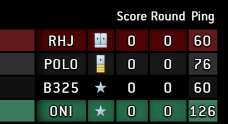
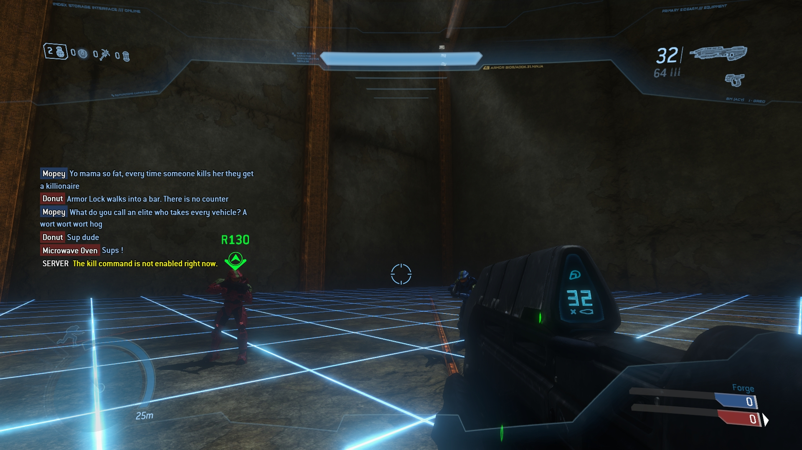
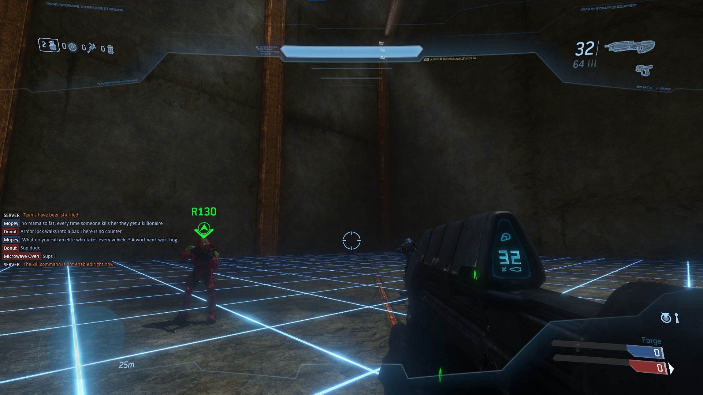
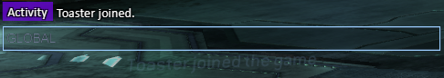

# Eldewrito UI Mods

Modifications to the interface to make so things better.

## Installation

Each folder contains a specific feature.

To install said feature, just get the folder(s) inside said feature folder and drop them to merge inside the game\ui\screens\ directory.

For example, with the browser autoconnect, drop the browser and dialog folders inside the game\ui\screens\ folder to merge them with the existing browser and dialog folders.

If you need help to figure it out, DM me on Discord at microwave.oven.

## Features

### Browser Autoconnect Queue

Allows you to automatically connect to a server if it's full.

### Ping Display

Shows "actual" ping instead of bars.

Note that the actual ping is not very accurate.

### Chat appearance

Puts the chat more to the side, lowers the font and a few other changes so the chat doesn't take too much of the screen.

| Before                               | After                              |
| ------------------------------------ | ---------------------------------- |
|  |  |

Also notifies in chat when a player leaves or joins.

## Revert changes

Go into the backup folder and proceed with the same instructions as with the Installation step