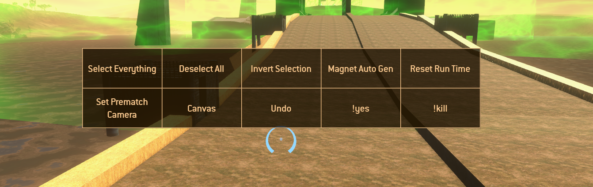
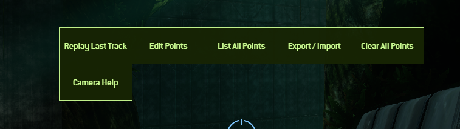

# Eldewrito UI Mods

Modifications to the interface to make so things better.

## Installation

Each folder contains a specific feature.

To install said feature, just get the folder(s) inside said feature folder and drop them to merge inside the game\ui\screens\ directory.

For example, with the browser autoconnect, drop the browser and dialog folders inside the game\ui\screens\ folder to merge them with the existing browser and dialog folders.

If you need help to figure it out, DM me on Discord at microwave.oven.

## Features

### Browser Autoconnect Queue

Allows you to automatically connect to a server if it's full.

### Ping Display

Shows "actual" ping instead of bars.

Note that the actual ping is not very accurate.

### Chat appearance

Puts the chat more to the side, lowers the font and a few other changes so the chat doesn't take too much of the screen.

| Before                               | After                              |
| ------------------------------------ | ---------------------------------- |
|  |  |

Also notifies in chat when a player leaves or joins.

### Forge Quick Actions

Adds a quick action menu to simplify your forging workflow.

Installation notes:

- As with the rest, copy `screens.json` and the `forge_quick` folder inside your `game\ui\screens\` directory. (It'll ask you if you want to overwrite the `screens.json` file, say yes)
- In your `dewrito_prefs.cfg` file, add the following line at the end: `bind 4 Game.ShowScreen forge_quick` where `4` is the key you want to bind it to. (Which I think it's a good key, as 1 is powerup, 2 is flashlight and 3 is emotes)
- In the `forge_quick\forge_quick.js` file, set the `bindKey` variable to the same key you used to bind it. It'll allow you to press it to close the menu. (The Escape key and the right click also close the menu)
- In the `forge_quick\forge_quick.js` file, you can change the `enableMouseUpChooseAction` variable to be able to hold the bind key, select with your mouse then release the bind key to execute the selected action. Default is false;

### Camera Mode / Camera Tracker / Cinematic Camera

Allows you to setup camera shots in forge to showcase your map, demo video WIP.

Select the files in `misc/camera_tracking/` and copy them in the game's `ui\screens\` directory.

If you want to use this alongside Forge Quick Actions, remove the `screens.json` file and rename `screens_with_forge_actions_rename_to_screens.json` to `screens.json`

Don't forget to bind the menu by putting `bind C Game.ShowScreen camera_tracking_actions` at the bottom of the `dewrito_prefs.cfg` file located in your game's `\data\` folder.

Find the commands by doing `/help` in chat.

## Revert changes

Go into the backup folder and proceed with the same instructions as with the Installation step